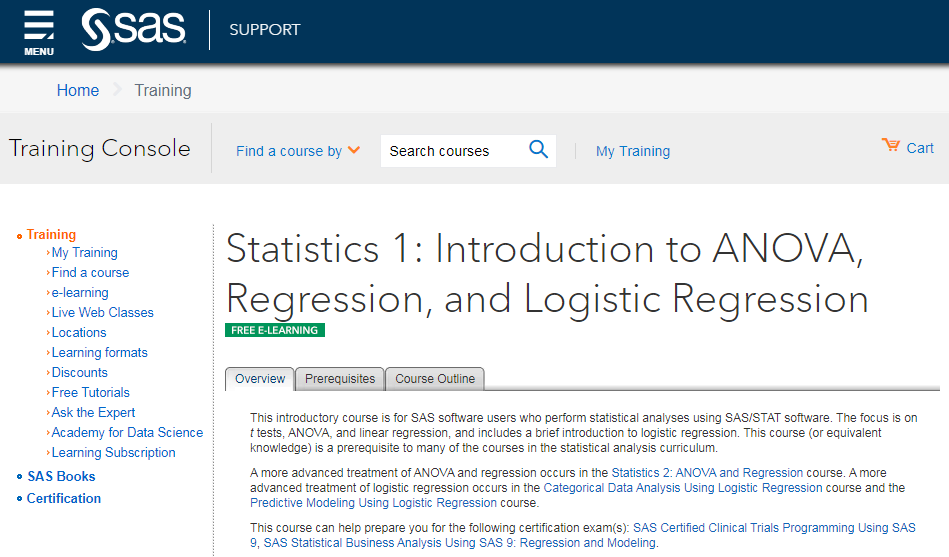

# Curso de Statistics-1-Introduction-to-ANOVA-Regression-and-Logistic-Regression-de-SAS
Statistics 1: Introduction to ANOVA, Regression, and Logistic Regression de SAS

Link de acceso al curso  : https://support.sas.com/edu/schedules.html?ctry=us&crs=STAT1#s1=1

## Course Overview and Review of Concepts

**Descriptive statistics.**

-	Inferential statistics.
-	Examining data distributions.
-	Obtaining and interpreting sample statistics using the UNIVARIATE procedure.
-	Examining data distributions graphically in the UNIVARIATE and FREQ procedures.
-	Constructing confidence intervals.
-	Performing simple tests of hypothesis.
-	Performing tests of differences between two group means using PROC TTEST.

**ANOVA and Regression**

-	Performing one-way ANOVA with the GLM procedure.
-	Performing post-hoc multiple comparisons tests in PROC GLM.
-	Producing correlations with the CORR procedure.
-	Fitting a simple linear regression model with the REG procedure.

**More Complex Linear Models**

-	Performing two-way ANOVA with and without interactions.
--	Understanding the concepts of multiple regression.

**Model Building and Effect Selection**

-	Automated model selection techniques in PROC GLMSELECT to choose from among several candidate models.
-	Interpreting and comparison of selected models.

**Model Post-Fitting for Inference**

-	Examining residuals.
-	Investigating influential observations.
- Assessing collinearit.

**Model Building and Scoring for Prediction**

-	Understanding the concepts of predictive modeling.
-	Understanding the importance of data partitioning.

-	Understanding the concepts of scoring.
- Obtaining predictions (scoring) for new data using PROC GLMSELECT and PROC PLM.

**Categorical Data Analysis**

-	Producing frequency tables with the FREQ procedure.
-	Examining tests for general and linear association using the FREQ procedure.
-	Understanding exact tests.
-	Understanding the concepts of logistic regression.
-	Fitting univariate and multivariate logistic regression models using the LOGISTIC procedure.
-	Using automated model selection techniques in PROC LOGISTIC including interaction terms.
-	Obtaining predictions (scoring) for new data using PROC PLM.

